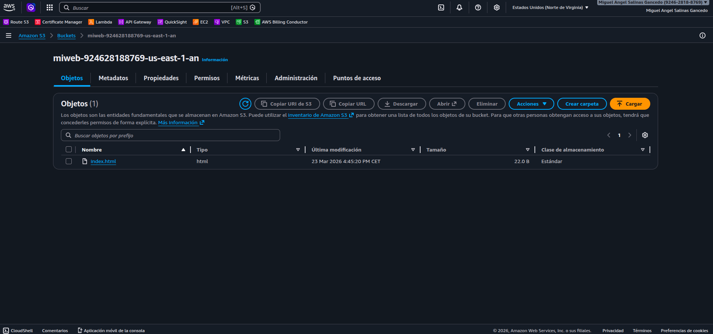
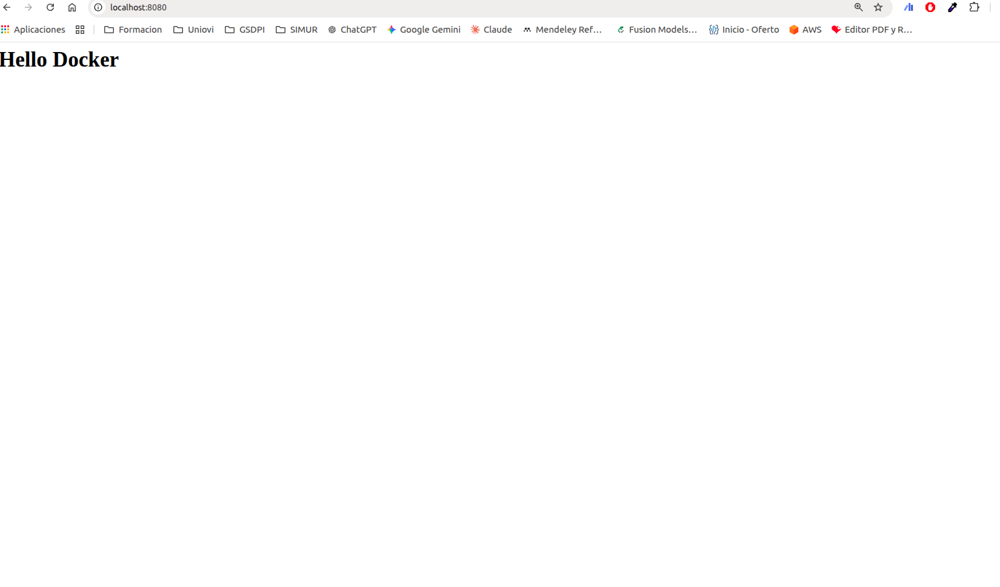

# Description
PoC Docker with AWS S3. We will use the [rclone docker plugin](https://hub.docker.com/r/rclone/docker-volume-rclone)

## Steps 01: Install FUSE (requirement for rclone)
Fuse3 it's a library to be use by any application, in our case by the docker plugin, to interact with the kernel modules used to mount folders in your host.

```
$ sudo apt update && sudo apt install fuse3 -y
```
Also you must configure fuse to allow use the volume to anyone like this. Edit `/etc/fuse.conf` and uncomment `user_allow_other`. After this
we must use the plugin argument `-o allow_other=true` when start a docker container

```
# The file /etc/fuse.conf allows for the following parameters:
#
# user_allow_other - Using the allow_other mount option works fine as root, in
# order to have it work as user you need user_allow_other in /etc/fuse.conf as
# well. (This option allows users to use the allow_other option.) You need
# allow_other if you want users other than the owner to access a mounted fuse.
# This option must appear on a line by itself. There is no value, just the
# presence of the option.

user_allow_other


# mount_max = n - this option sets the maximum number of mounts.
# Currently (2014) it must be typed exactly as shown
# (with a single space before and after the equals sign).

#mount_max = 1000
```

## Steps 02: Create the required plugin directories
```
$ sudo mkdir -p /var/lib/docker-plugins/rclone/config
$ sudo mkdir -p /var/lib/docker-plugins/rclone/cache
```

## Steps 03: Create the Rclone Config
```
$ sudo nano /var/lib/docker-plugins/rclone/config/rclone.conf

[mys3]
type = s3
provider = AWS
access_key_id = YOUR_ACCESS_KEY
secret_access_key = YOUR_SECRET_KEY
region = us-east-1
endpoint = s3.us-east-1.amazonaws.com
```

## Steps 04: Install the Rclone Plugin
```
$ docker plugin install rclone/docker-volume-rclone:amd64 \
  --alias rclone \
  --grant-all-permissions \
  args="-v"
```

## Steps 05: Create a bucket in AWS/Region


We can test that we our credentials we see our index.html file uploaded to the bucket using the AWS CLI

```
$ AWS_ACCESS_KEY_ID=YOUR_ACCESS_KEY \
AWS_SECRET_ACCESS_KEY=YOUR_SECRET_KEY \
aws s3 ls s3://miweb-924628188769-us-east-1-an

2026-03-23 16:45:20         22 index.html
```

## Steps 06: Create the Docker Volume
```
$ docker volume create miweb \
  -d rclone \
  -o remote=mys3:miweb-924628188769-us-east-1-an \
  -o allow_other=true \
  -o vfs_cache_mode=full
```

## Steps 07: Start the Container
```
$ docker run -d \
  --name nginx-s3 \
  -p 8080:80 \
  -v miweb:/usr/share/nginx/html \
  nginx
```



## Some links

- [rclone docker plugin docs](https://rclone.org/docker/): official documentation
